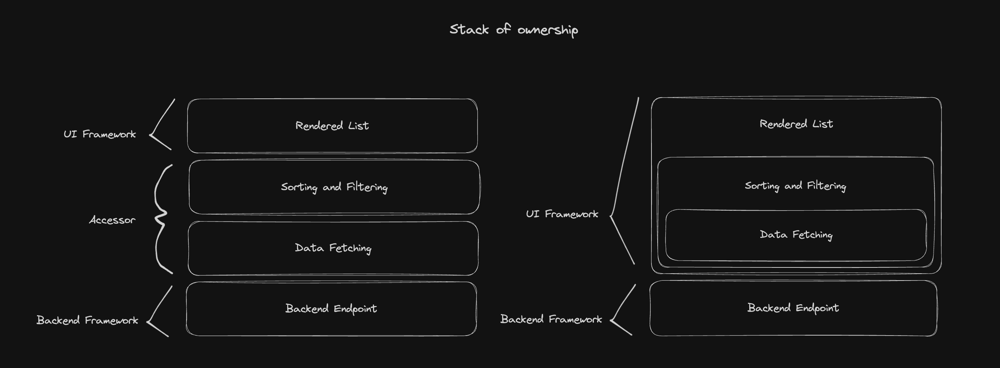

# Accessors

### real-time data transport

Accessors are a bridge between the data provider, some backend api, and the user interface. They can be "configured" to fetch some data, cache it and process it, on demand.
After receiving a new configuration, for example, add an id to a list of item ids, the accessor checks, if the item is in the local cache, if not, fetch it asynchronously and push it back to the requestee.
Some Configuration may only affect the processed state of the local cache. In that case the cache is reused to process the requested data structure on the client.
Accessors are based on a message architecture, they communicate in request and response messages. The api interface receives requests from the accessors and responds in response messages to them.
A single accessor can handle multiple types of requests and responses.
As a result, accessors handle bidirectional data transfer. They can push state to the client without a request. And are easy to use within a multi threaded environment.
Ideally the api interface is implemented with a webworker, so that requests can directly be handed to the backend, instead of calling an intermediate fetch for every internal request.
The messaging architecture also enables internal message types, like load progress state messages for fetch calls.

To be clarified:

- location and implementation of caching -- use of browser cache, or by service worker implementation.
- cache invalidation — checking with the backend for updates. - Backend could return a hash of latest data, requires backend support though. — Client could assume, in a specific time span, that available data in cache is up to date. Only refetch if timeframe is exceeded, just how the browser cache works.
- request cancelation / abort signals
